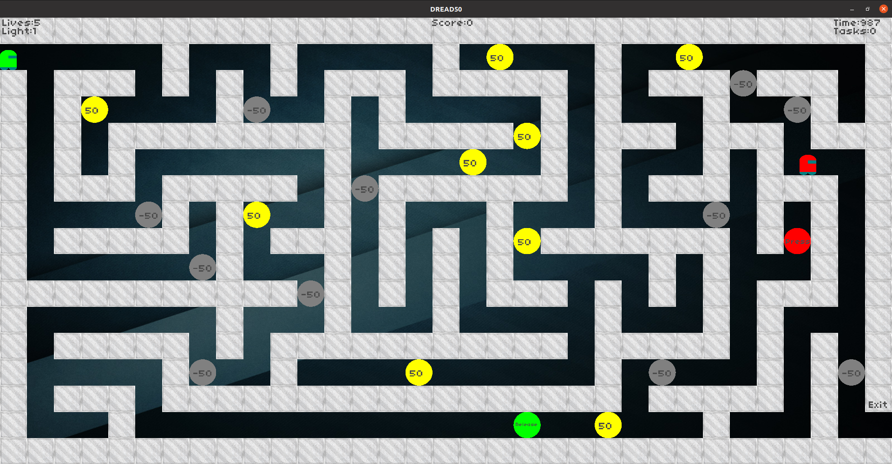

# DREAD50

> Programmed by Ashwin Mittal

> A quick guide to starting the game.

## Screenshots



## Running

Once you have downloaded and extracted it, run the following commands.

```bash
$ cd 2019101105
$ mkdir build
$ cd build
$ cmake ..
$ make
$ ./graphics
```

## Instructions

- LEFT, RIGHT, UP, and DOWN keys to move the player.
- `Space` key to change the lighting.
- `Esc` key to quit the game.
